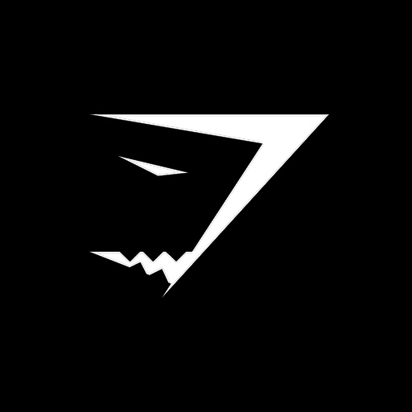

<p align="center">
    
</p>

# XCTShark

<div>
  
  
  
  
</div>

## Summary

...

## Requirements

Xcode 15 or above
Swift 5.9 or later

## Installation

**Xcode project**

If you are using Xcode open `File -> Add Package Dependencies...` and enter url `https://github.com/gymshark/ios-parameterized-tests`

**Swift package manager**

In `Package.swift` add:

``` swift
dependencies: [
  .package(url: "https://github.com/gymshark/ios-parameterized-tests", branch: "main")
]
```

and then add the product to your test target.

```swift
.product(name: "XCTShark", package: "XCTShark"),
```

and import it in your UnitTest file

```swift
import XCTShark
```

## Examples
